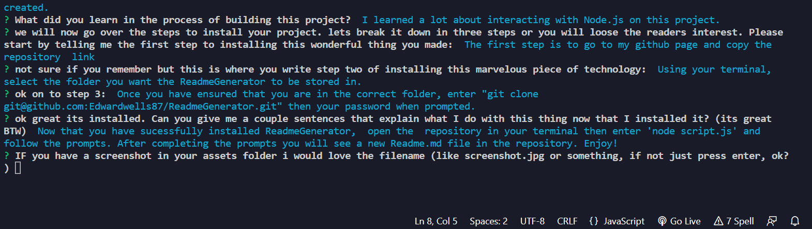

# <ReadmeGenerator>

  ## Table of Contents 

 - [Description](#description)
 - [Installation](#installation)
 - [Usage](#usage)
 - [Credits](#credits)
 - [License](#license)

## Description 

-I built this project out of necessity, I am not a huge fan of finishing off every single project with markdown. I dont want to spend days working on the proper syntax of languages I am just starting to understand, finally complete something great and then have to go digging for a good readme to refresh my memory.  Being able to just answer a few simple questions after I complete a project is much more efficient than how I was doing it previously. This project This project solves the problem of having to put too much time and thought into a readme after having exhausted yourself in code on a project. It's hard enough trying to find the words to sum up the beauty that you created. 

## Installation 

- The first step is to go to my github page and copy the repository  link
- Using your terminal, select the folder you want the ReadmeGenerator to be stored in.
- Once you have ensured that you are in the correct folder, enter "git clone git@github.com:Edwardwells87/ReadmeGenerator.git" then your password when prompted. 

## Usage 

- Now that you have sucessfully installed ReadmeGenerator,  open the  repository in your terminal then enter 'node script.js' and follow the prompts. After completing the prompts you will see a new Readme.md file in the repository. Enjoy!

  ## License 
      None
  
  

  